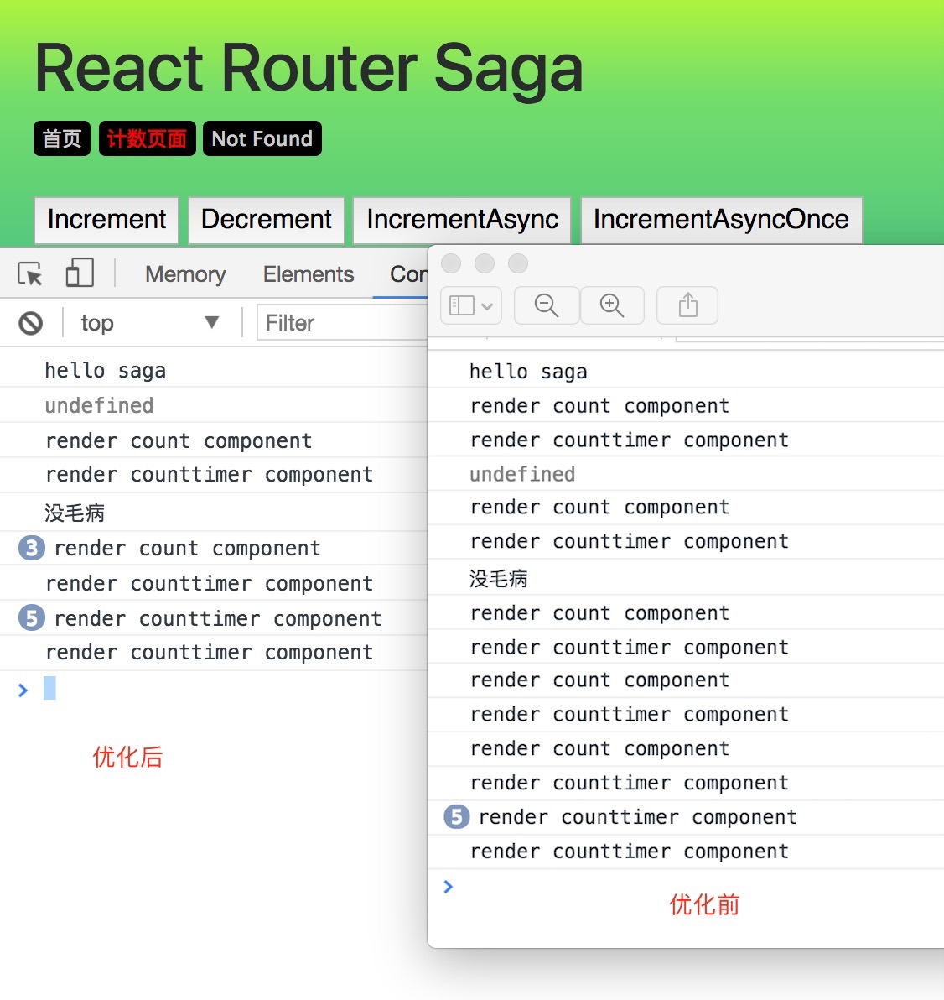

# React实战骨架 
> 持续更新中，保持依赖包版本最新 🇨🇳
<div align="center">
  <a href='https://facebook.github.io/react/'>
    
  </a>
</div> 
<div align="center">
  <a href="https://github.com/webpack/webpack">
    
  </a>
  <a href="https://reacttraining.com/react-router/">
    
  </a>
</div> 
<div align="center">
  <a href='http://redux.js.org'>
    
  </a>
</div> 
<div align="center">
  <a href='https://github.com/redux-saga/redux-saga'>
    
  </a>
</div> 

## <a name="features">&sect; 技术栈</a>
> 详情可参阅 `package.json`

* React 15.6.1
* Redux 3.7.1
* React-redux 5.0.5
* React-router-dom 4.1.1 
* Redux-saga 0.15.4
* Webpack 3.0.0
* Babel-ESlint + Pre-ommit
* Axios 0.16.2
* ES6 + Babel
*** 

## <a>&sect; 功能点</a>

* React、Redux 全家桶
* React-router 路由
* Redux-saga 实用工具
* redux-form 表单实例  
* Axios 网络请求（内有 fetch，可自行切换）
* Mock 数据API接口
* 热替换 样式文件变化，自动渲染不刷新；js文件变化，刷新浏览器
* ESlint `git` 提交时候，语法规则自动校验  
***

## <a name="features">&sect; 更新内容</a>  
> 2017/06/30 升级 `webpack 3.0`，解决了样式文件热替换问题  
> 2017/06/30 修复 `git commit` 提交时候，校验 `es7 decorator` 不通过问题  
> 2017/06/29 
1. `webpack` 暂时回退 `2.6.1` 版本
因为升级 `3.0` 后，样式文件变化时，浏览器只能自动刷新，而不是自动渲染不刷新
2. 增加 `redux-form` 表单验证组件
> 2017/06/26 更新 `package` 依赖  
> 2017/06/22 更新 `webpack 3.0`，增加 `scope hoisting`  
> 2017/06/08 增加倒计时组件 `CountTimer` ；引用 `pure-render-decorator`，提升渲染性能；增加装饰器 decorator  
> 2017/06/06 更新 `package` 依赖，据说 `Webpack3` 出来了，后面会更新……  
> 2017/06/01 更新 `package` 依赖  
> 2017/05/22 对提取的 `server` 进行小的优化  
> 2017/05/16 增加 `mock` 数据，引用 `axios` 模块，并提取 `server` 请求  
> 2017/05/15 更新 `redux-saga` 最新版本用法 更新 `react-router4` 最新版用法  
> …………  
***

## <a name="features">&sect;  构建开发环境</a>
> 基于 [vue-cli](https://github.com/vuejs/vue-cli) 构建修改

## <a name="features">&sect;  precommit</a>
> 基于 `babel-eslint` 语法校验  

自动校验
```js
git commit -m '提交信息'
```  
手动启动校验  
```
npm run eslint
```
手动修复不符合规则代码
```
npm run fix
```
## <a name="reference">&sect; 参考资料</a>
* [redux-saga中文站点](http://leonshi.com/redux-saga-in-chinese/docs/introduction/BeginnerTutorial.html)
* [react-redux](https://github.com/vue-china/react-redux-starter-kit)

## <a name="architecture">&sect; 项目架构</a>
### <a name="tree">⊙ 目录结构</a>
```
.
├─ build/               # 基于Vue-cli实现的Webpack构建目录
├─ dist/                # build 生成的生产环境下的项目
├─ src/                 # 源码目录
│   ├─ assets/          # images
│   ├─ components/      # 组件（COMPONENT）
│   ├─ const/           # 常量集中管理
│   ├─ containers/      # 容器
│   ├─ reducers/        # 函数因子
│   ├─ routers/         # 路由
│   ├─ saga/            # 路由视图基页（VIEW）
│   ├─ server/          # 网络请求提取
│   ├─ utils/           # 公用方法封装提取
│   ├─ main.js          # 主入口文件
├── static/             # 放置无需经由 Webpack 处理的静态文件
├── test/               # vue-cli产出的测试目录，暂时没有处理，待更
├── index.html          # 静态模板页面，开发和build产出，都依赖它
├── .babelrc            # Babel 转码配置
├── .eslintignore       # ESLint 检查中需忽略的文件（夹）
├── .eslintrc           # ESLint 配置
├── .gitignore          # git忽悠提交
├── .postcssrc.js       # postcss配置项，vue-cli产出
├── package.json        # 很重要的东西了
```
## <a name="reference">&sect; 操作</a>
项目下载
```
git clone https://github.com/brucecham/react-cli.git
cd react-cli && yarn
```
启动开发环境
```
yarn start
```
构建生产环境代码
```
yarn build
```
运行测试代码
```
yarn test
```
## <a name="reference">&sect; package版本更新</a>
> 可使用 [ncu](https://www.npmjs.com/package/npm-check-updates)
```
ncu -a
```
## <a name="reference">&sect; 启动静态服务器</a>
> [sts启动静态服务器](https://www.npmjs.com/package/sts)
```
yarn build
cd dist && sts 8090
```
## <a name="modify">&sect; 性能优化</a>
### 1、引入 `pure-render-decorator` ，优化渲染判断(shouleComoonentUpdate)
```js
import pureRender from "pure-render-decorator"
class CountTimer extends Component {
  ...
}
export default pureRender(CountTimer)
```
或应用decorator装饰器语法 **推荐用法**
```js
import pureRender from "pure-render-decorator"
@pureRender
class CountTimer extends Component {
  ...
}
export default CountTimer
```
<div align="center">
  
</div>
